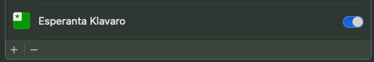
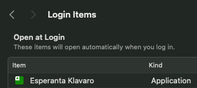
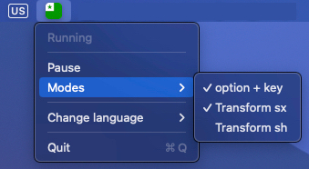

# Esperanta Klavaro

A macOS keyboard application for easily typing the Esperanto diacritic letters (i.e. the letters with "hats", which are also known in esperanto as "ĉapelitaj literoj"):  ĉ, ĝ, ĥ, ĵ, ŝ, and ŭ. This application allows the user to enter Esperanto letters by holding down the **option** key while pressing the specified letter to transform it into its hat-version, and/or by automatically transforming key combinations into the corresponding Esperanto letter, following the [X-System](https://en.wikipedia.org/wiki/Substitutions_of_the_Esperanto_alphabet#X-system) or the [H-System](https://en.wikipedia.org/wiki/Substitutions_of_the_Esperanto_alphabet#H-system). (For example, typing *sx* would result in *ŝ*).

Esperanta Klavaro runs in the background listens for the configured key combinations to convert normal letters into Esperanto letters. When the application is running, an icon will be visible in the menu bar. Clicking the icon will reveal the settings interface.

To find out more about Esperanto, click [here](https://www.nicholasjhershy.com/esperanto.html)

## Setup

Download the application [here](https://github.com/nhershy/EsperantaKlavaroMacOS/raw/13ab2d4bf61e7c7bbe93f85d9d67e46595757f35/.github/assets/Esperanta%20Klavaro.dmg)

Once downloaded, double click on the dmg file, and drag "Esperanta Klavaro" into the "Applications" folder. 
Then double click the "Applications" folder, and double click "Esperanta Klavaro" to start the application.

Then you must:
1) Add Accessibility Configuration 
2) Configure to Launch on Startup

### How to add Accessibility configuration 

Open System Settings

Click Privacy & Security

Click Accessibility

Click the "+" symbol at the bottom

Find the "Esperanta Klavaro" application in the "Applications" folder

Ensure the switch is set to ON

    

### How to configure to Launch on Startup

Open System Settings

Click General

Click Login Items

Click the "+" at the bottom

Select "Esperanta Klavaro" in the "Applications" folder

    

### Modes
There are 3 different modes for typing Esperanto letters. Any combination of them can be enabled at the same time.

    

**Mode 1**

Press and hold the **option** key as you press c, g, h, j, s, u, and they will transform into ĉ, ĝ, ĥ, ĵ, ŝ, ŭ.

**Mode 2**

Esperanta Klavaro has a keyboardListener event that watches the letters typed, and when it sees the combination of a latin letter plus *x*, it will automatically transform it into the corresponding Esperanto letter. This is known as the X-System.

**Mode 3**

The same as mode 2 but with *h*. This is known as the H-System.

## Are you looking for an Esperanto spellchecker for macOS? 

Check out [EsperantoSpellcheckMacOS](https://github.com/nhershy/EsperantoSpellcheckMacOS)!
